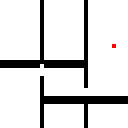

# ROS2 Neural A*

### A quick rundown of the project:

An attempt to create the first ROS2 plugin for a data driven machine learning approach to search-based planning.

This plugin will consist of a modified encoder decoder network trained on costmaps generated from indoor robot simulations using ROS2's navigation2 stack.

This project attempts to generate a variant of the Neural A* search based on  "Path Planning using Neural A\* Search", ICML, 2021 [[paper]](https://arxiv.org/abs/2009.07476) [[project page]](https://omron-sinicx.github.io/neural-astar/) that is trained and modified to perform path planning on realtime costmaps generated by SLAM Toolbox.


Neural A\* is a novel data-driven search-based planner that consists of a trainable encoder and a differentiable version of A\* search algorithm called differentiable A* module. Neural A\* learns from demonstrations to improve the trade-off between search optimality and efficiency in path planning and also to enable the planning directly on raw image inputs.

It reformulates a canonical A* search algorithm to be differentiable and couple it with a convolutional encoder to form an end-to-end trainable neural network planner. Neural A* solves a path planning problem by encoding a problem instance to a guidance map and then performing the differentiable A* search with the guidance map. By learning to match the search results with ground-truth paths provided by experts, Neural A* can produce a path consistent with the ground truth accurately and efficiently.

| A\* search | Neural A\* search | 
|:--:|:--:|
|  | |

Omron's extensive experiments confirmed that Neural A* outperformed state-of-the-art data-driven planners in terms of the search optimality and efficiency trade-off. Furthermore, Neural A* successfully predicted realistic human trajectories by directly performing search-based planning on natural image inputs.

### Goals:

A testbench ROS2 plugin which allows for testing of Neural A* in commonly simulated indoor mobile robot environments.

### Roadmap:

- [ ] Setting up a simulation environment - Turtlebot3 with Nav2 on Ubuntu 18.04, ROS2 Humble, SLAM Toolbox
- [ ] Dataset collection with TB3
- [ ] Evaluation on Vanilla Neural A*
- [ ] Model retraining and Encoder-Decoder network optimisation for CostMaps
- [ ] Creating the Neural A* node that runs realtime on subscribed CostMaps
- [ ] Developing the planner plugin to be compatible with Nav2's planner server virtual methods.

Future considerations:

* Improvements along the lines of adding a parameter interface between the planner plugin and the Neural A* node that allows for tuning and configuring the planner.
* Adding new heuristics and inclusion of Ackermann and Omnidirectional dynamics.

## Citation

```
# ICML2021 version
@InProceedings{pmlr-v139-yonetani21a,
  title =      {Path Planning using Neural A* Search},
  author    = {Ryo Yonetani and
               Tatsunori Taniai and
               Mohammadamin Barekatain and
               Mai Nishimura and
               Asako Kanezaki},
  booktitle =      {Proceedings of the 38th International Conference on Machine Learning},
  pages =      {12029--12039},
  year =      {2021},
  editor =      {Meila, Marina and Zhang, Tong},
  volume =      {139},
  series =      {Proceedings of Machine Learning Research},
  month =      {18--24 Jul},
  publisher =    {PMLR},
  pdf =      {http://proceedings.mlr.press/v139/yonetani21a/yonetani21a.pdf},
  url =      {http://proceedings.mlr.press/v139/yonetani21a.html},
}

# arXiv version
@article{DBLP:journals/corr/abs-2009-07476,
  author    = {Ryo Yonetani and
               Tatsunori Taniai and
               Mohammadamin Barekatain and
               Mai Nishimura and
               Asako Kanezaki},
  title     = {Path Planning using Neural A* Search},
  journal   = {CoRR},
  volume    = {abs/2009.07476},
  year      = {2020},
  url       = {https://arxiv.org/abs/2009.07476},
  archivePrefix = {arXiv},
  eprint    = {2009.07476},
  timestamp = {Wed, 23 Sep 2020 15:51:46 +0200},
  biburl    = {https://dblp.org/rec/journals/corr/abs-2009-07476.bib},
  bibsource = {dblp computer science bibliography, https://dblp.org}
}
```

## Acknowledgments
This repository includes some code from [RLAgent/gated-path-planning-networks](https://github.com/RLAgent/gated-path-planning-networks) [1] with permission of the authors and from [martius-lab/blackbox-backprop](https://github.com/martius-lab/blackbox-backprop) [2].

## References
- [1] [Lisa Lee*, Emilio Parisotto*, Devendra Singh Chaplot, Eric Xing, Ruslan Salakhutdinov, "Gated Path Planning Networks", ICML, 2018.](https://arxiv.org/abs/1806.06408)
- [2] [Marin Vlastelica Pogančić, Anselm Paulus, Vit Musil, Georg Martius, Michal Rolinek, "Differentiation of Blackbox Combinatorial Solvers", ICLR, 2020.](https://arxiv.org/abs/1912.02175)
